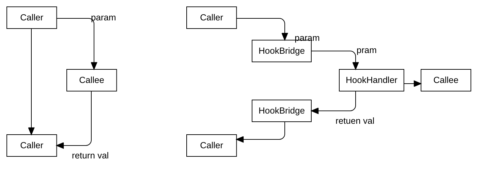

# js hook

## 定义

### 描述
hook: 劫持代码执行流程，改变函数参数，返回值，控制方法是否执行。可以在没有软件原作者同意的情况下，任意修改二进制发布版本软件。

### 流程图



### hook & 源码重编
1. 如果能够修改源码，那么一般来说源码修改远比hook方便。
2. 系统/框架API无法轻松通过源码修改实现我们的目的
3. js由于是解释型语言，代码==二进制，一般使用源码修改方法
4. JS语言由于是解释型语言，无法通过全局root定位到js所有方法定义，现代js为了避免变量污染大多对js代码进行多层js函数包装。故很难通过框架自动化寻找hook点

## hook和AOP

## 方法hook

https://gitee.com/HGJing/everthing-hook/tree/master/

## getter & setter hook

```js

// ==UserScript==
// @name         cookie
// @namespace    http://tampermonkey.net/
// @version      0.1
// @description  try to take over the world!
// @author       公众号:python学习开发
// @include      *
// @grant        none
// ==/UserScript==

(function() {
    'use strict';
    var cookie_cache = document.cookie;
    Object.defineProperty(document, 'cookie', {
        get: function() {
            console.log(cookie_cache);
            return cookie_cache;
        },
        set: function(val) {
            debugger;
            var cookie = val.split(";")[0];
            var ncookie = cookie.split("=");
            var flag = false;
            var cache = cookie_cache.split(";");
            cache = cache.map(function(a){
                if (a.split("=")[0] === ncookie[0]){
                    flag = true;
                    return cookie;
                }
                return a;
            })
            cookie_cache = cache.join(";");
            if (!flag){
                cookie_cache += cookie + ";";
            }
        },
    });

})();
```

