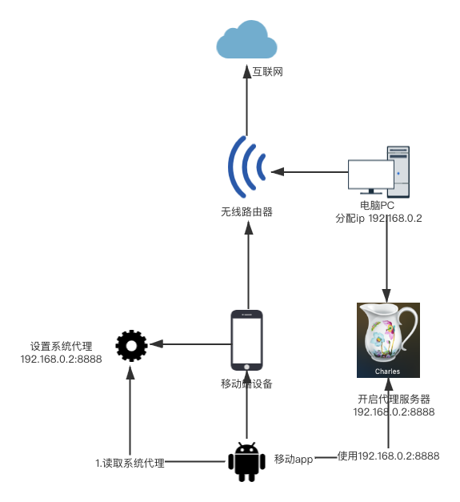
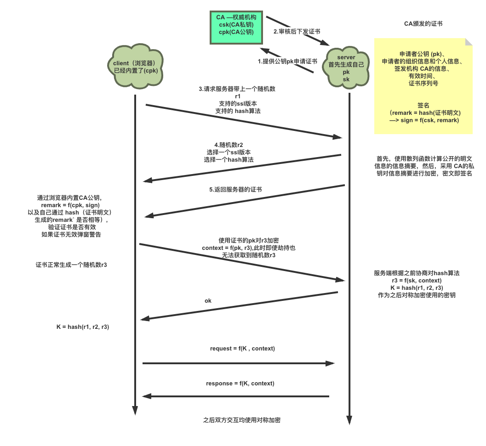
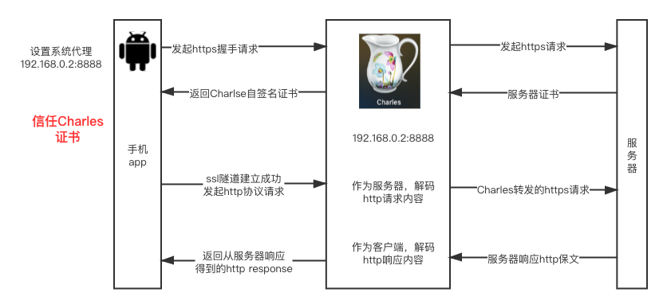

# 抓取正式入门-http抓包

## 中间人攻击原理
- 几乎所有app都使用http协议
- 抓包工具： fiddler，charles，wireshark
- https抓包： https证书

## https抓包流程

### http和https和ssl

#### ssl算法可靠性

- CA机构
- 系统根证书
- 非对称加密算法和其可靠性
    - 加解密
    - 签名

#### ssl认证过程

- 用户端发起HTTPS请求，将SSL协议版本的信息发送给服务端。
- 服务端去CA机构申请来一份CA证书，证书里面有服务端公钥和签名。将CA证书发送给用户端
- 用户端读取CA证书的明文信息，采用相同的hash散列函数计算得到信息摘要（hash目的：验证防止内容被修改），而后用操作系统带的CA的公钥去解密签名（由于签名是用CA的私钥加密的），比照证书中的信息摘要。假如一致，则证实证书是可信的，而后取出了服务端公钥
- 用户端生成一个随机数（密钥F），用刚才等到的服务端B_公钥去加密这个随机数形成密文，发送给服务端。
- 服务端用自己的B_私钥去解密这个密文，得到了密钥F
- 服务端和用户端在后续通讯过程中就使用这个密钥F进行通信了。
- 开始使用以密钥F为密码的对成加密通信

#### https抓包流程

### 客户端信任charles证书
- android 6.0前，安装charles root证书到Android系统根证书目录。
- android 6.0后，root手机，root权限安装根证书
- httpClient证书特定校验-JustTrustMe，hook证书检查逻辑
- 代理不生效

## https证书认证破解
- JustTrustMe的使用

# 未解决问题

## ssl双向认证
## 代理不生效
